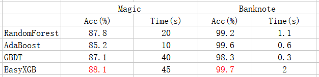
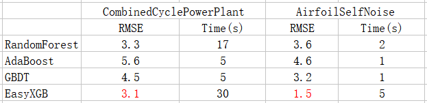
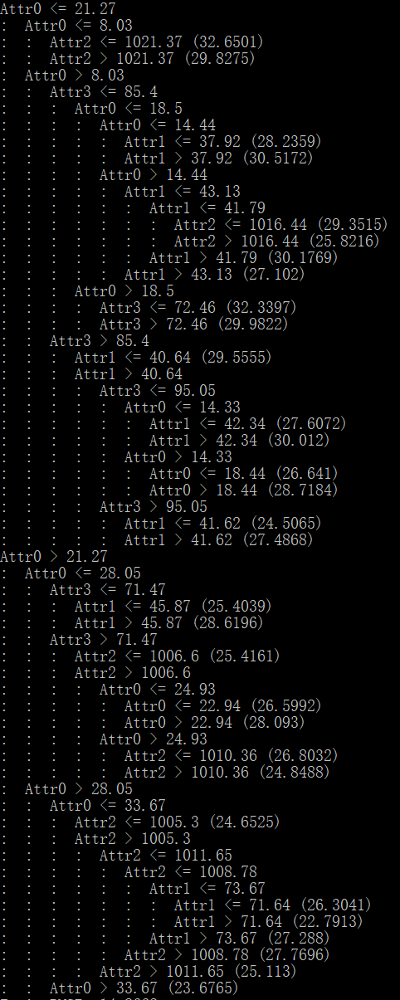

# EasyXGB
**A simple stand-alone version of XGBoost named EasyXGB.**


In this repository, I implemented a simple stand-alone version of [XGBoost](https://arxiv.org/pdf/1603.02754.pdf) named **EasyXGB** without referencing to any other code. The implemented version is highly accurate and efficient, which supports classification, regression, tree pruning, column sampling, discrete attributes (no need to convert to one-hot representation), missing value attributes, and cross-validation, etc. In addition, to prevent model overfitting, min_data_in_leaf is used to control the minimum number of samples per leaf node similarly to lightgbm.  The implemented version is simple to use, just need to specify model parameters (such as number of trees, tree depth, and other optional parameters) and data path (currently only support csv format). To visualize the trained model, you can print the generated trees by specifying print_tree to true in the model parameters. In order to verify the accuracy and efficiency of the framework, comparative experiments were performed on several data sets. The experimental results are detailed below.


## Experiments
**Four UCI data sets** are used for comparison experiments, two for regression, and others for classification. The data sets are as follows.
- [Magic](http://archive.ics.uci.edu/ml/datasets/MAGIC+Gamma+Telescope)
- [Banknote](http://archive.ics.uci.edu/ml/datasets/banknote+authentication)
- [CombinedCyclePowerPlant](http://archive.ics.uci.edu/ml/datasets/Combined+Cycle+Power+Plant)
- [AirfoilSelfNoise](http://archive.ics.uci.edu/ml/datasets/Airfoil+Self-Noise)

**Three ensemble methods(from sklearn)** are used as comparison algorithms. The **10-folds cross-validation** experimental results are as follows.

**Classification**



**Regression**



**The printed trees just like this.**



## Requirements
- g++ >= 4.7

## Usage
**Step 1.** 
Clone this repository with ``git``.
```
$ git clone https://github.com/VectorFist/EasyXGB.git
$ cd EasyXGB
```

**Step 2.** 
Build and train.
```
$ change necessary parameters in main.cpp
$ make
$ ./EasyXGB
```
